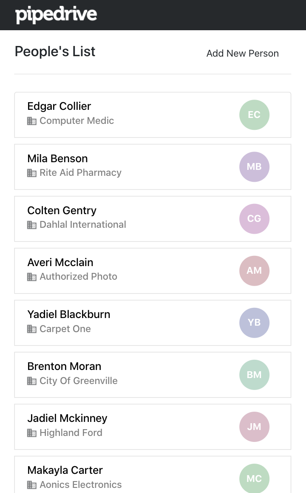
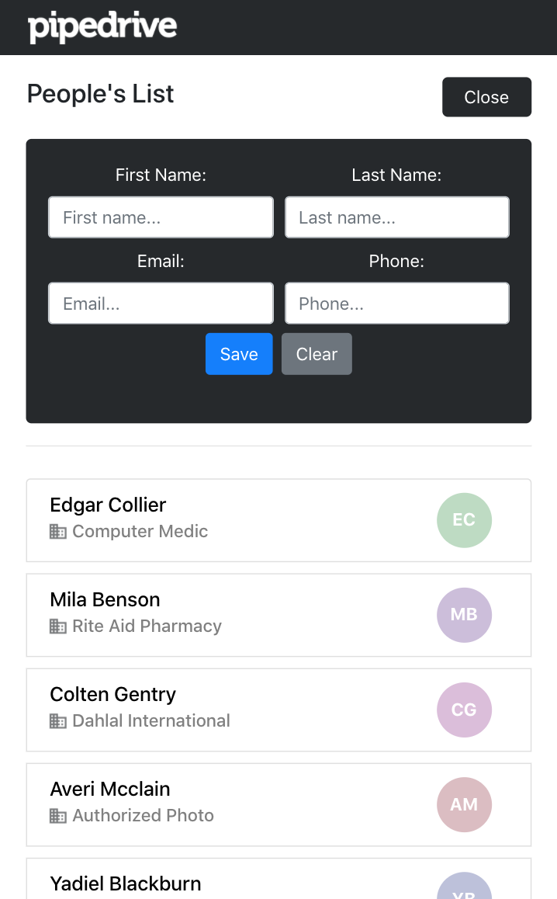
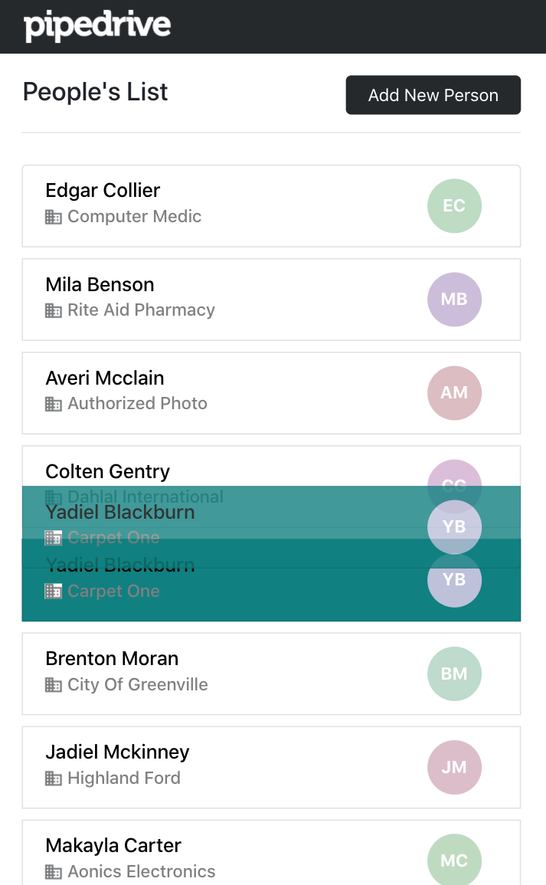

# Pipedrive Users CRUD Single Page Application 

This project calls upon the Pipedrive API to create a sortable list of contacts.

Easily drag contacts to re-order.
Use the form to Edit or Delete contacts.

## To run this project...:

- you'll need an API key. Either ask me for my key or sign up to use the [Pipedrive API](https://developers.pipedrive.com/)
- clone this repo
- have `npm` installed
- use `npm start` to run locally

| Contact List | Edit contact | Drag and Drop |
|:---:|:---:|:---:|
|  |  |  |